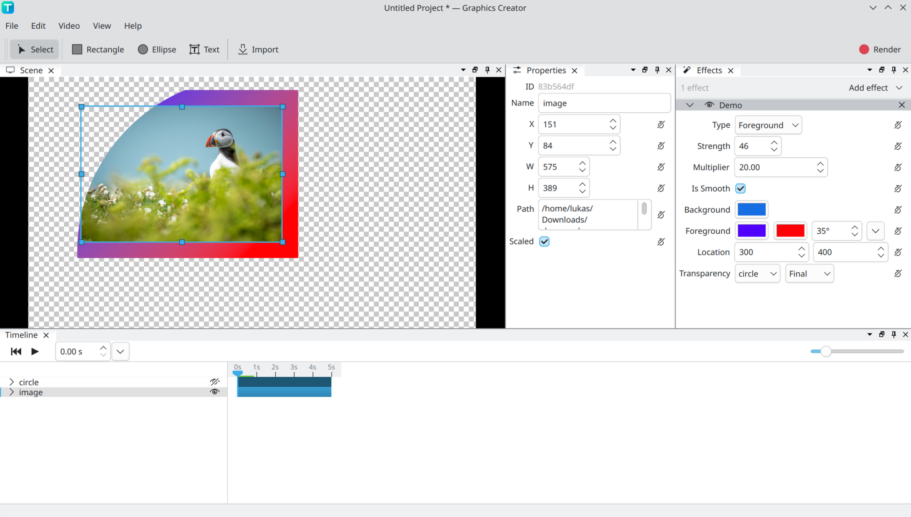

# Example

All example plugin source code on this page is licensed under [MIT](https://opensource.org/license/mit).

## Example effect using all properties

Most properties are unused in the rendering in this example.

### Preview



### Source

```cpp
#include "plugin.hpp"
#include "gc_plugin_api.hpp"

void getRenderBox(PluginInterface *intf,
                  PluginEffectRenderContext *renderContext,
                  const Rect &lastBox) {
    int strength = intf->functions->getPropertyInt(
        intf->functions->getEffectProperty(renderContext, "strength"));
    renderContext->renderBox = {lastBox.x - strength, lastBox.y - strength,
                                lastBox.w + strength * 2,
                                lastBox.h + strength * 2};
}

bool render(PluginInterface *intf, PluginEffectRenderContext *renderContext,
            const uint32_t *source, const Rect &sourceRect, uint32_t *target) {
    Rect rect = renderContext->renderBox;
    int type = intf->functions->getPropertyInt(
        intf->functions->getEffectProperty(renderContext, "type"));
    int strength = intf->functions->getPropertyInt(
        intf->functions->getEffectProperty(renderContext, "strength"));
    auto background = intf->functions->getPropertyColor(
        intf->functions->getEffectProperty(renderContext, "background"));
    auto foregroundBrush = intf->functions->getPropertyBrush(
        intf->functions->getEffectProperty(renderContext, "foreground"));
    auto transparency = intf->functions->getPropertyElementSelection(
        intf->functions->getEffectProperty(renderContext, "transparency"));
    auto transparencySnippet =
        intf->functions->getSnippet(renderContext, transparency);

    for (int y = 0; y < rect.h; y++) {
        for (int x = 0; x < rect.w; x++) {

            uint8_t finalR = 0;
            uint8_t finalG = 0;
            uint8_t finalB = 0;
            uint8_t finalA = 255;

            if (x < strength || y < strength || x >= rect.w - strength ||
                y >= rect.h - strength) {
                Color c = type == 0
                              ? background
                              : intf->functions->getBrushPixel(
                                    foregroundBrush, x, y, rect.w, rect.h);
                finalR = c.r;
                finalG = c.g;
                finalB = c.b;
                finalA = c.a;
            } else {
                auto [r, g, b, a] = extractRGBA(source[pixelIndex(
                    x - strength, y - strength, sourceRect.w)]);
                finalR = r;
                finalG = g;
                finalB = b;
                finalA = a;
            }

            float alphaMultiplier = 1;
            if (transparencySnippet.values) {
                int snippetX = x - transparencySnippet.rect.x + rect.x;
                int snippetY = y - transparencySnippet.rect.y + rect.y;
                if (snippetX >= 0 && snippetY >= 0 &&
                    snippetX < transparencySnippet.rect.w &&
                    snippetY < transparencySnippet.rect.h) {
                    uint8_t alphaValue =
                        transparencySnippet.values[pixelIndex(
                            snippetX, snippetY, transparencySnippet.rect.w)] >>
                        24;
                    alphaMultiplier = alphaValue / 255.;
                } else {
                    alphaMultiplier = 0;
                }
            }

            target[pixelIndex(x, y, rect.w)] =
                makePixel(finalR, finalG, finalB, finalA * alphaMultiplier);
        }
    }
    return true;
}

int gcPluginInit(PluginInterface *intf, PluginInitData *data) {
    data->id = "samplePlugin";
    data->name = "Sample Plugin";
    data->version = "1.0.0";

    Effect *effect =
        intf->functions->createEffect(data, data->name, "demo", "Demo");
    intf->functions->setEffectGetRenderBoxFunc(effect, getRenderBox);
    intf->functions->setEffectRenderFunc(effect, render);

    Property *type =
        intf->functions->addEffectProperty(effect, PROPERTY_TYPE_INT, "type");
    intf->functions->addPropertyMenuItem(type, "Background");
    intf->functions->addPropertyMenuItem(type, "Foreground");

    Property *strength = intf->functions->addEffectProperty(
        effect, PROPERTY_TYPE_INT, "strength");
    intf->functions->setPropertyInt(strength, SET_MIN, 0);
    intf->functions->setPropertyInt(strength, SET_MAX, 100);
    intf->functions->setPropertyInt(strength, SET_DEFAULT, 20);

    Property *multiplier = intf->functions->addEffectProperty(
        effect, PROPERTY_TYPE_DOUBLE, "multiplier");
    intf->functions->setPropertyDouble(multiplier, SET_DEFAULT, 20);

    Property *isSmooth = intf->functions->addEffectProperty(
        effect, PROPERTY_TYPE_BOOL, "isSmooth");
    intf->functions->setPropertyBool(isSmooth, SET_DEFAULT, true);

    Property *background = intf->functions->addEffectProperty(
        effect, PROPERTY_TYPE_COLOR, "background");
    intf->functions->setPropertyColor(background, SET_DEFAULT,
                                      {23, 111, 227, 255});

    intf->functions->addEffectProperty(effect, PROPERTY_TYPE_BRUSH,
                                       "foreground");

    Property *location = intf->functions->addEffectProperty(
        effect, PROPERTY_TYPE_VECTOR2DINT, "location");
    intf->functions->setPropertyVector2DInt(location, SET_DEFAULT, {300, 400});

    intf->functions->addEffectProperty(effect, PROPERTY_TYPE_ELEMENT_SELECTION,
                                       "transparency");

    return 0;
}
```
