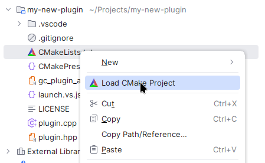
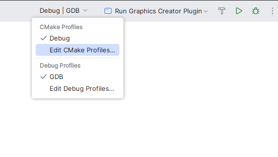
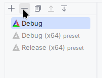
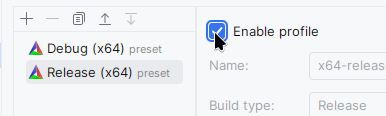
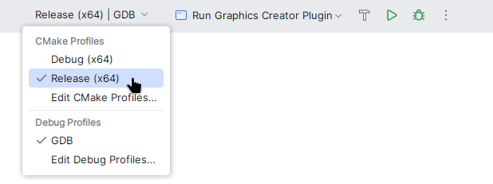

# Linux: CLion

Before continuing, if starting on a new plugin, you have to download the plugin sample. This is available on the GitHub release page in "Assets". Then extract it into a new folder with the name of your plugin.

## 1. Install libraries

To be able to build, you may have to install certain libraries:

```bash
# Fedora
sudo dnf install libstdc++-static
```

## 2. Load CMake

In CLion with the project open, right click on CMakeLists.txt, then click on "Load CMake Project".



## 3. Select CMake Profiles

By default, CLion doesn't use the project profile presets, so you have to enable them manually.

To do this, on the top right corner select "Debug | GDB" and then "Edit CMake Profiles...":



Then delete the default "Debug" profile:



And enable the preset profiles:



## 4. Test in release

In case you want to test or build in release mode, which is recommended for distribution, switch the target next to the run button.


