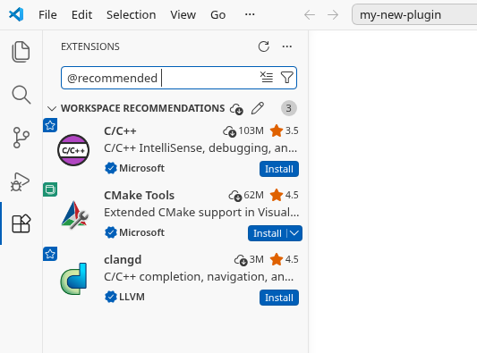
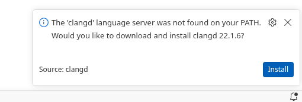
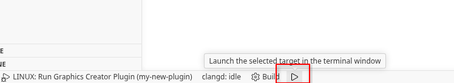

# Linux: VS Code

Before continuing, if starting on a new plugin, you have to download the plugin sample. This is available on the GitHub release page in "Assets". Then extract it into a new folder with the name of your plugin.

## 1. Install libraries

To be able to build, you may have to install certain libraries:

```bash
# Fedora
sudo dnf install libstdc++-static
```

## 2. Open folder

You may have to trust the folder once opening it in Visual Studio Code.

## 3. Install extensions

Install these recommended extensions for development:

- **C/C++ by Microsoft:** Used for debugging
- **CMake Tools by Microsoft:** Used for setting up targets
- **clangd by LLVM:** Used for code navigation



In case clangd asks to install the language server, click install:



## 4. Run

Press <kbd>F5</kbd> or at the bottom the play button to run the project. You may have to open the plugin.cpp file first. After configuring or building you may have to restart VS Code.



## 5. Test in release

In case you want to test or build in release mode, which is recommended for distribution, you have to switch the target to release.

To do this, open the CMake tab on the navigation bar, then under "Configure" under "Project Status", click the edit icon and switch it to release. There you can also switch it back to debug.


