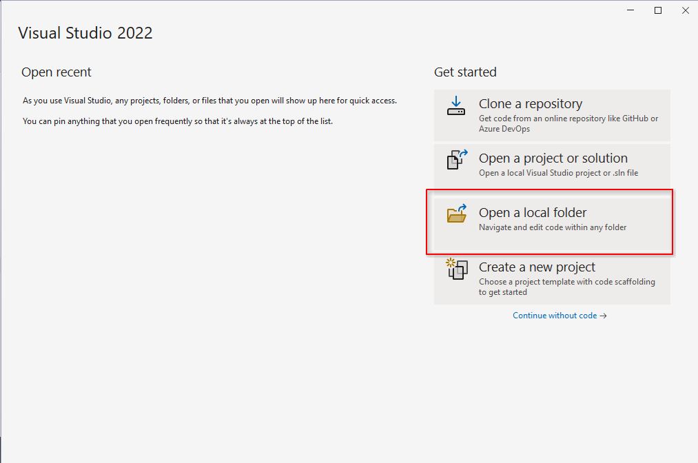
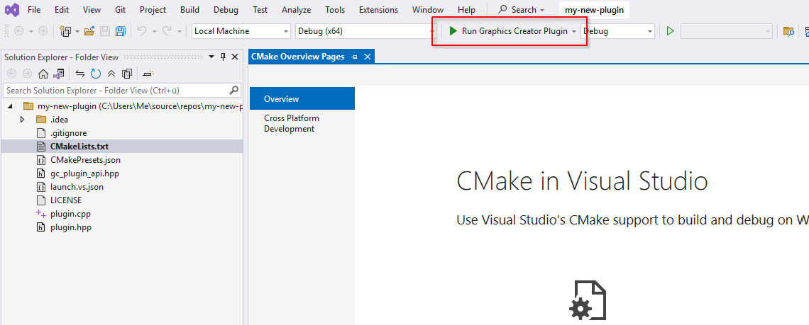

# Windows: Visual Studio

Before continuing, if starting on a new plugin, you have to download the plugin sample. This is available on the GitHub release page in "Assets". Then extract it into a new folder with the name of your plugin.

## 1. Install workload

In the Visual Studio installer program, make sure C++ development is checked and installed.

## 2. Open folder

In the Visual Studio main splash screen, select "Open a local folder", and select your new plugin folder. The plugin folder should contain the "CMakeLists.txt" file at the root of the folder.

## 3. Run

Once the project has been opened, you are now ready to develop your plugin. Click on "Run Graphics Creator Plugin" at the top to begin building and debugging.

## 4. Test in release

In case you want to test or build in release mode, which is recommended for distribution, switch the target next to the run button.

