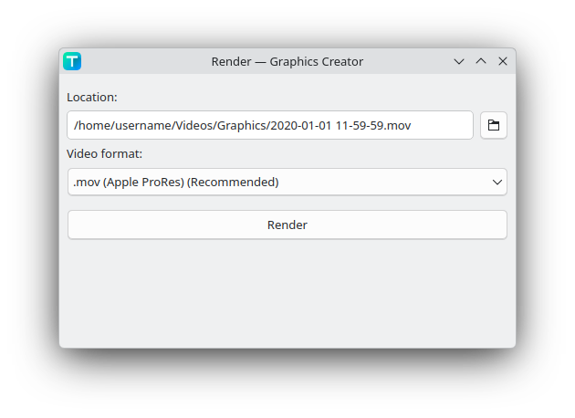

# Exporting / Rendering

## Rendering

To render a project to a video file, click on the render button on the top right corner of the program while having a project file open.

This will open the render dialog. The location of the path will by default be saved in a "Graphics" folder in your videos folder. To select a different folder, click the folder icon next to the path.



Specific video formats can be selected:

- **.mov (Apple ProRes) (Recommended)**
  - FFmpeg encoder: `prores`
- **.mp4 (H264), no transparency**
  - FFmpeg encoder: `libx264`
- **.mp4 (H264), no transparency, NVIDIA**
  - FFmpeg encoder: `h264_nvenc`
- **.webm (VP9)**
  - FFmpeg encoder: `libvpx-vp9`

When rendered, then a video file will appear in the render dialog. This file can then be dragged into a video editing program like Kdenlive.

## Rendering with the CLI

You can also render using the CLI.

```bash
graphics-creator --render "output.mp4" --encoder "libx264" "input.gcp"
```

The last argument is the project filename.

| Flag                            | Description                                                                                                           |
| ------------------------------- | --------------------------------------------------------------------------------------------------------------------- |
| `--render`                      | Specifies to what video filepath the project is rendered to.                                                          |
| `--encoder`                     | Sets the FFmpeg encoder. The list of encoders can be found when running `ffmpeg -encoders`.                           |
| `--overwrite` / `-y` (optional) | If the output filepath already exists, then by default it does not overwrite it. Use this flag to overwrite the file. |
