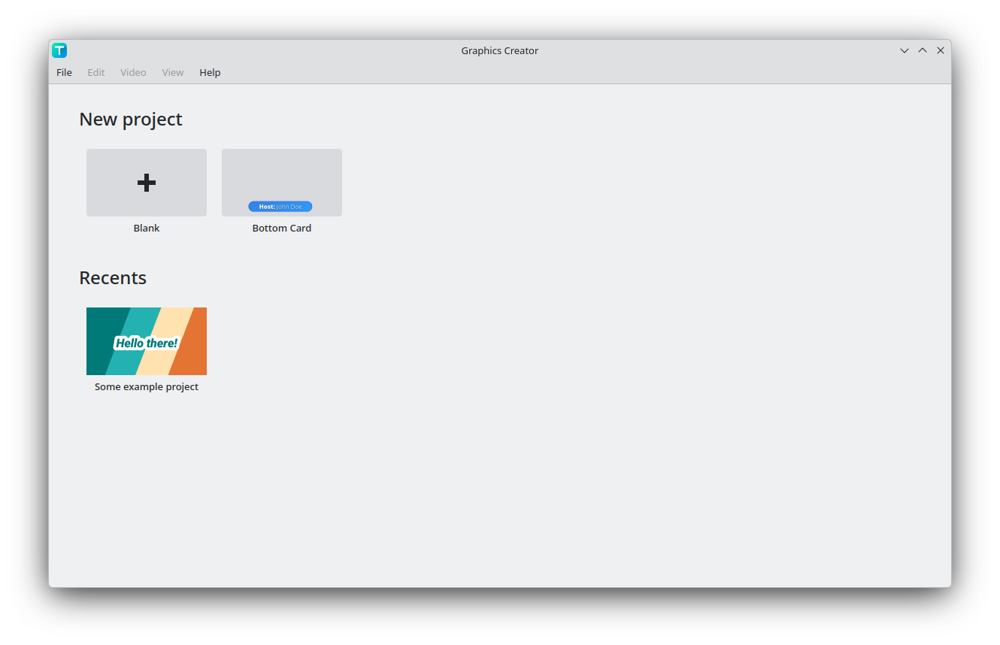

# Start Screen

After launching the program normally[^1], the start screen is displayed.

At the top in the "New project" section, you can either create a new blank project, or select one of the templates. You can skip the video settings dialog by holding shift while creating a new proejct.

When a project is saved, then the project is added to the recents section, and can be opened from there.

[^1]: With no command line flags or project file opened.
