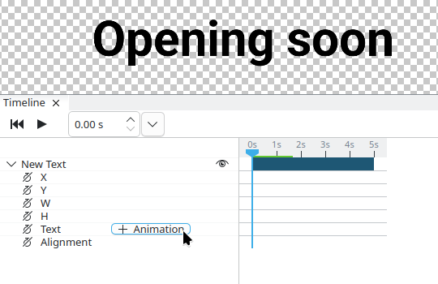
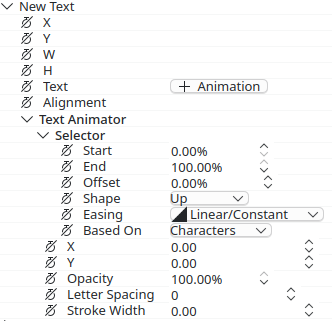
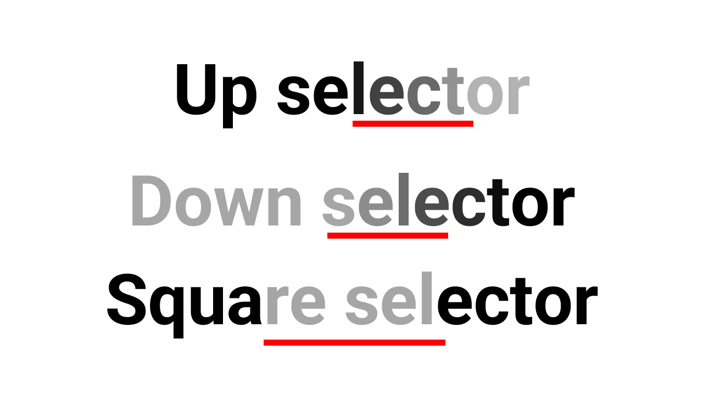

# Text Animation

Text animators allow you to animate specific properties in a specific selection of letters/words/lines.

To add a text animator, open the element in the timeline, and click "+ Animation".

When adding a new text animator, a selector is added with it, with properties being visible below it.

## Selector Shapes

There are different selector shapes.

- **Up:** Transitions from `Start` (values not set) to `End` (values set).
- **Down:** Transitions from `Start` (values set) to `End` (values not set). This is the reverse of Up.
- **Square:** Sets the values inside `Start` and `End` to the properties.

In this example the opacity property is set to 30%, with the selector ranges underlined in red:

## Selector Ranges

Ranges in the selector operate in percent of the text. They can be set with the `Start` and `End` properties.

The `Start` and `End` properties can be offset with the `Offset` property. This is useful when making text animations that go left→right/right→left with specific properties. The animation region can then be made smaller by lowering the `End` value.

The range values can also be smoothed out with the `Easing` property.

:::tip
Use the "In" easings instead of the "Out" easings for text animators.
:::

<video class="small-video" loop controls muted src="/videos/docs/text-easing.webm"></video>
